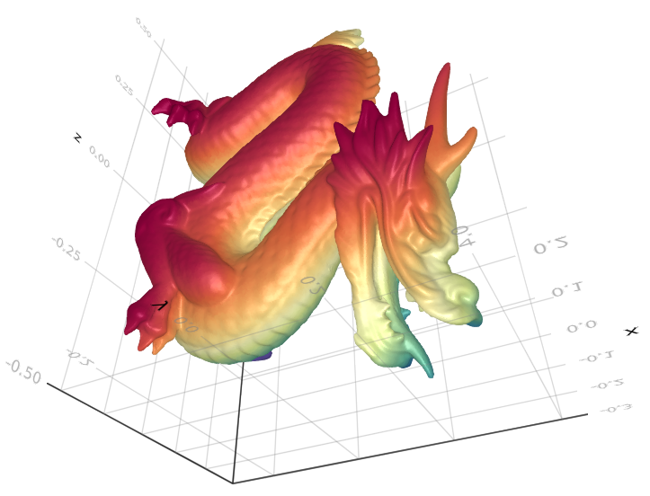

# MeshViz.jl

Makie.jl recipes for visualization of Meshes.jl objects.

## Installation

Get the latest stable release with Julia's package manager:

```julia
] add MeshViz
```

## Usage

```julia
using Meshes, MeshViz
import GLMakie

using PlyIO

function readply(fname)
  ply = load_ply(fname)
  x = ply["vertex"]["x"]
  y = ply["vertex"]["y"]
  z = ply["vertex"]["z"]
  points = Meshes.Point.(x, y, z)
  connec = [connect(Tuple(c.+1)) for c in ply["face"]["vertex_indices"]]
  SimpleMesh(points, connec)
end

mesh = readply("beethoven.ply")

viz(mesh)
```


```julia
mesh = readply("dragon.ply")

viz(mesh,
  showfacets=false,
  elementcolor=1:nelements(mesh),
  colormap=:Spectral
)
```


```julia
using GeoTables

# Brazil states as Meshes.jl polygons
BRA = GeoTables.gadm("BRA", children=true)

viz(BRA.geometry)
```


```julia
viz(BRA.geometry, elementcolor=1:length(BRA.geometry))
```


Please check the docstring `?viz` for available attributes.
